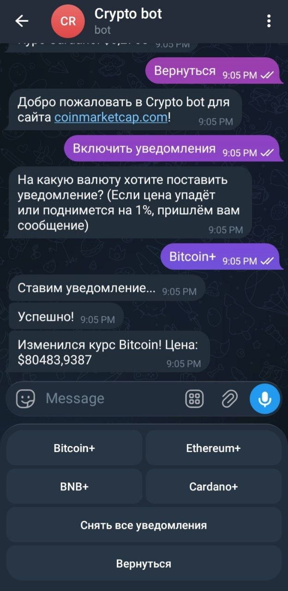
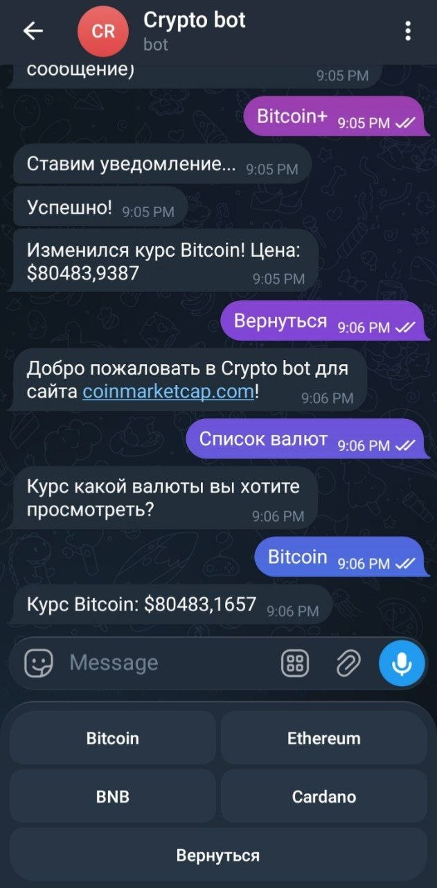

TelegramCryptoBot создан на C# для того, чтобы просматривать актуальный курс популярных валют. Также имеется функция присылать уведомление, если валюта упала или поднялась на 1%.

Стек технологий:
C#

Библиотеки:
Telegram.Bot,
Microsoft.Extensions.Configuration для работы с конфигурацией токена бота

